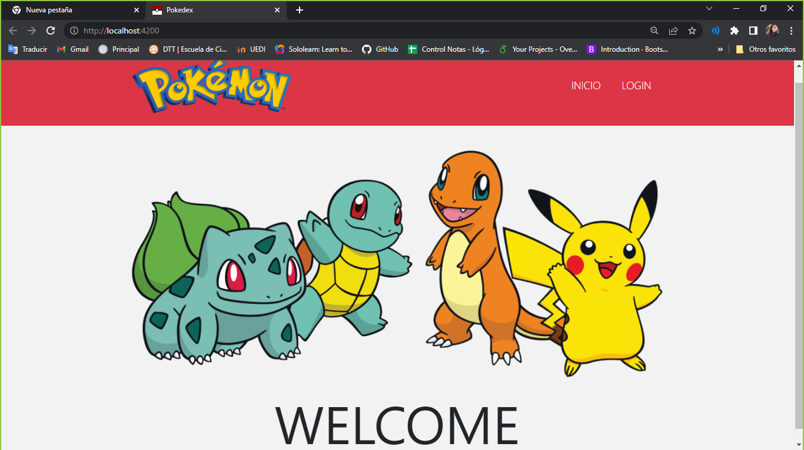
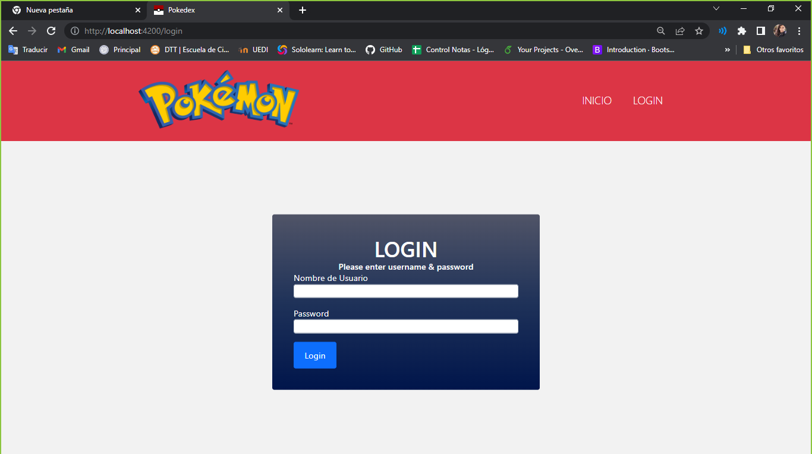
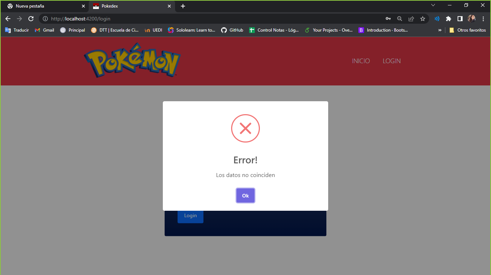
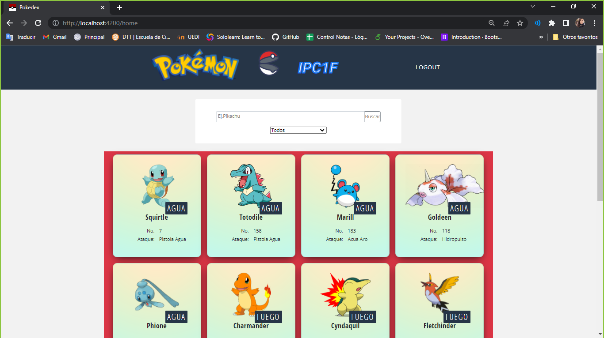
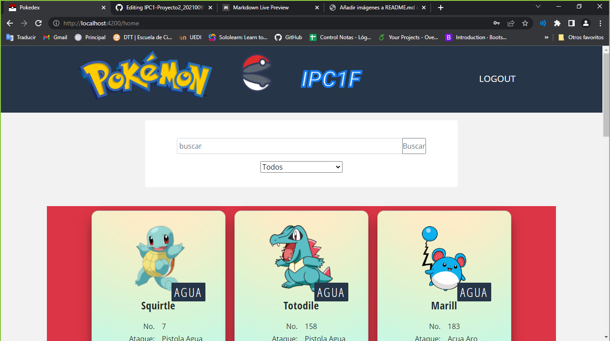
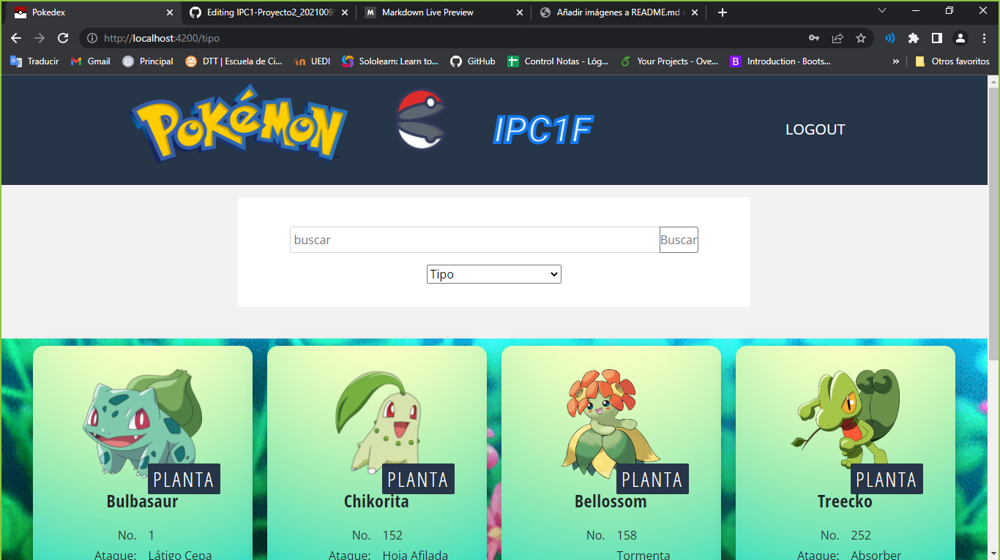
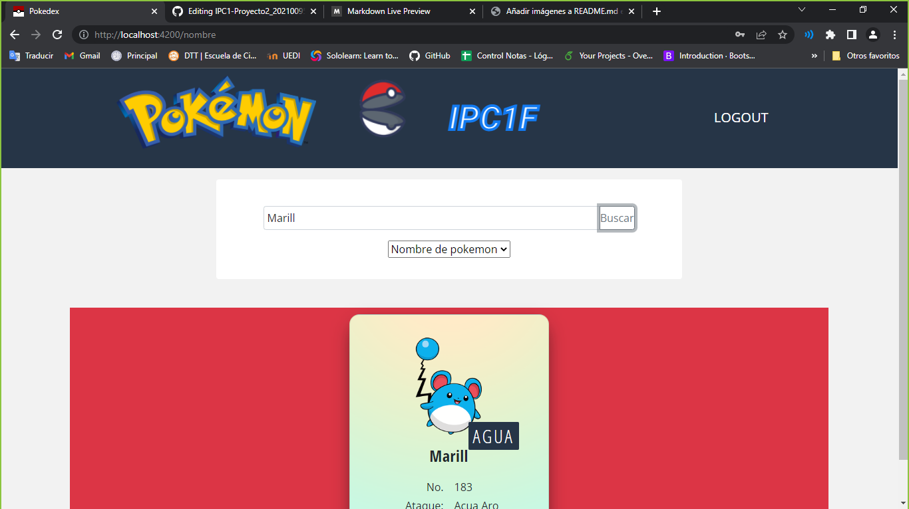
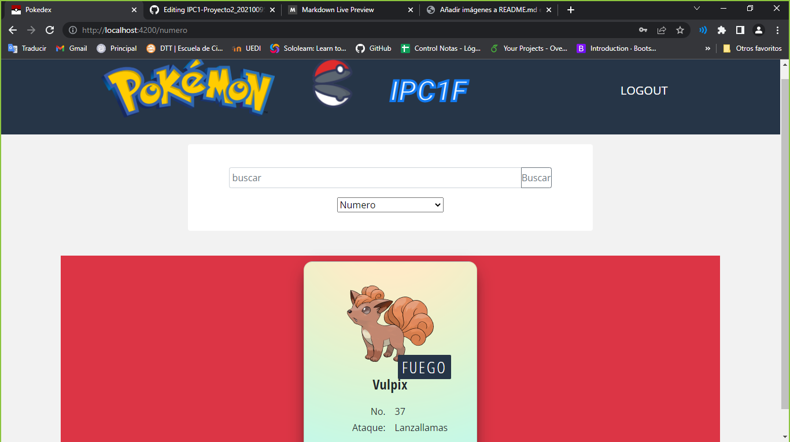

# REPORTE

## Tabla de datos 

|  Carnet   |             Nombre             |       Nombre de Auxiliar       |
| --------- | ------------------------------ |:------------------------------:|
| 202100953 | Damaris Julizza Muralles Véliz | Javier Oswaldo Mirón Cifuentes | 

## Frontend:

### Tecnología utilizada:
_Para este proyecto se utilizaron las siguientes tecnologias:_

* Angular
* Typescrip
* HTML y CSS

_Angular y Typescrip se utilizaron para la realización de toda la logica de programación necesaria para traer al fronted la información de los servicios y mostrar estos datos al usuario, mientras que para la elaboración de cada componente en la página se utilizó  codigo en Html y para darle los estilos necesarios se utilizó CSS._

### Servicios implementados:
_En el proyecto se utilizo un servicio para  acceder a los datos y entregarlos a los componentes correspondientes, este es:_
* PokemonService

_Este servicio se encarga de proporcionar  los datos que se necesitan desde el backend._

### Manual de uso:
#### Descripción:
_Para interactuar en esta aplicacion web debera de ejecutar el servidor que proporciona la información a esta e ingresar en su buscador a la siguiente dirección:_ **http://localhost:4200** 

_Tome en cuenta que las imágenes en este manual son únicamente con fines ilustrativos y pueden diferir ligeramente._

#### Inicio:
_Una vez que haya ingresado a la URL en donde se encuentra la aplicación se mostrara en su pantalla la siguiente vista:_

_Como se puede apreciar en la imagen, en la parte superior se encuentran dos botones, el boton de Inicio redirecciona a la misma ventana mostrada anteriormente, mientras aue el de Login le redicccionara a la ventana en donde podra ingresar a su usruario._

#### Login:

_Como se muestra en la imagen una vez que se encuentra en la pagina para el login  usted podra regresar a la pagina de inicio al presionar el boton que corresponde y en caso contrario podra ingresar los datos de su usuario, nombre de usuario y contraseña, en caso que los datos que se ingresen sean incorrectos aparecera en su ventana la siguiente alerta:_

#### Home:
_Una vez ingresado a su usuario se le montrara la siguiente ventana:_

_En la parte superior al lado de la imagen de la pokeball se mostrara el nombre de su usuario y a un lado encontrara el boton de Logout que al presionarlo lo redireccionara a la pagina de inicio._

_Un poco mas abajo encontrara dos barras, la primera es una barra de busqueda en donde usted podra ingresar el dato que desea encontrar y el segundo es un menu desplegable en donde usted filtrara la información, esto se explicara más a detalla más adelante._

_Abajo de estas barras de busqueda se le mostrara todos los pokemon que se encuentran registrados  y podra visualizarlos todos al mover la barra lateral de su navegador._
#### Busquedas:
_Para realizar las busquedas, debera de seleccionar en el menu desplegable el tipo de dato que desea filtrar, es decir por nombre del pokemon, por su id, por su tipo o si desea ver todos los pokemon en el sistema._

_Posterior a esto debe ingresar el nombre, id o tipo por el que desea buscar en la primera barra de busqueda y presionar el boton para hacer dicha busqueda, dependiendo de lo escogido en se mostraran los datos que usted busco:_

## Backend: 
### Requerimientos del sistema:
_Para la ejecución de esta aplicación se necesitan los siguientes requerimientos:_
* Tener instalado en su ordenador el IDE de Visual Studio Code.
* Saber algunos conceptos basicos de programación.
* Installar los node_modules para el correcto funcionamiento de la aplicación.

### Modulos utilizados:
_Esta aplicación web utiliza distintos modulos tanto en el fronted como en el backend  y es necesario instalar estos modulos antes de la ejecución del programa ya que en caso contrario se generaram errores, para ello debe de utilizar el codigo npm i._

### Puerto utilizado:
_El servidor utilizado en el proyecto se encuentra en el puerto 3000, y puede acceder a este por medio de cualquier cliente HTTP colocando_
**http://localhost:3000/** 

### Descripción de Endpoint:
_El servidor, es decir la API, utiliza distintos endpoint para organizar la información, los cuales se detallan a continuación_
* users: _Este endpoint se encarga de proporcionar la información del usuario que inicie la sesión._
* Pokemon: _Este endpoint se encarga de proporcionar la información de todos los pokemon registrados en el API._
* PokemonNumero: _Este endpoint se encarga de obtener la información del pokemon dependiendo del Id._
* PokemonNombre: _Este endpoint se encarga de obtener la información del pokemon dependiendo del nombre ingresado para su busqueda._
* PokemonTipo: _Este endpoint se encarga de obtener la información del pokemon dependiendo de su Tipo._
